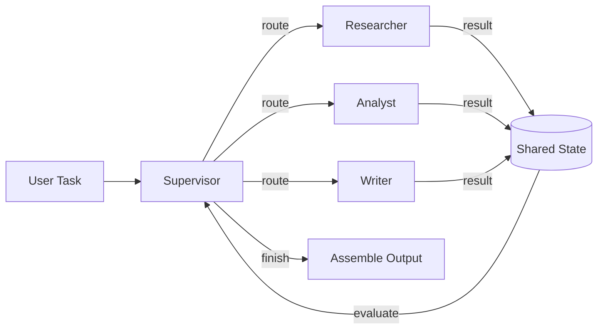

# Multi-Agent Orchestrator

[](https://www.python.org/downloads/)
[](https://github.com/langchain-ai/langgraph)
[](https://opensource.org/licenses/MIT)
[](https://streamlit.io/)

A lightweight multi-agent orchestration framework built with **LangGraph** that uses a Supervisor pattern to coordinate specialized AI agents for collaborative task solving.

---

## Table of Contents

- [Architecture](#architecture)
- [Quick Start](#quick-start)
- [Project Structure](#project-structure)
- [Configuration](#configuration)
- [Testing](#testing)
- [Example Use Cases](#example-use-cases)
- [Tech Stack](#tech-stack)
- [License](#license)

---

## Architecture



### How It Works

1. **User submits a task** via Streamlit UI or API
2. **Supervisor agent** analyzes the task and routes to the appropriate specialist
3. **Specialist agents** execute their part and return results to shared state
4. **Supervisor evaluates** progress and either routes to another agent or finalizes
5. **Final output** is assembled and presented to the user

### Agent Roles

| Agent | Role | Tools |
|-------|------|-------|
| **Supervisor** | Task decomposition, routing, quality control | Routing logic |
| **Researcher** | Information gathering from web sources | Web Search (Tavily), URL scraping |
| **Analyst** | Data processing, extraction, structured analysis | Python REPL, Calculator |
| **Writer** | Content synthesis, formatting, final output | Text generation |

---

## Quick Start

### Prerequisites

- Python 3.11+
- API keys: OpenAI or Anthropic + Tavily (for web search)

### Installation

```bash
git clone https://github.com/reiquileut/multi-agent-orchestrator.git
cd multi-agent-orchestrator
python -m venv .venv
source .venv/bin/activate  # Windows: .venv\Scripts\activate
pip install -r requirements.txt
cp .env.example .env
# Edit .env with your API keys
```

### Run the Demo

```bash
# Quick demo (no API keys needed — uses mock responses)
python demo.py

# Streamlit UI (requires API keys)
streamlit run app.py

# CLI (requires API keys)
python -m src.cli "Research the latest AI agent frameworks and write a comparison report"
```

### Docker

```bash
docker compose up --build
# Open http://localhost:8501
```

---

## Project Structure

```
multi-agent-orchestrator/
├── src/
│   ├── __init__.py
│   ├── config.py              # Environment & LLM configuration
│   ├── state.py               # Shared state definition (TypedDict)
│   ├── orchestrator.py        # LangGraph graph builder & compiler
│   ├── cli.py                 # CLI entry point
│   ├── agents/
│   │   ├── __init__.py
│   │   ├── supervisor.py      # Supervisor: task routing & evaluation
│   │   ├── researcher.py      # Researcher: web search & info gathering
│   │   ├── analyst.py         # Analyst: data processing & structuring
│   │   └── writer.py          # Writer: content synthesis & formatting
│   └── tools/
│       ├── __init__.py
│       ├── search.py          # Tavily web search wrapper
│       ├── calculator.py      # Safe math evaluation
│       └── text_processing.py # Text utilities (summarize, extract, etc.)
├── tests/
│   ├── __init__.py
│   ├── test_orchestrator.py   # Integration tests for the full graph
│   ├── test_agents.py         # Unit tests for individual agents
│   └── test_tools.py          # Unit tests for tools
├── .github/
│   └── workflows/
│       └── ci.yml             # GitHub Actions CI pipeline
├── app.py                     # Streamlit demo application
├── demo.py                    # Quick demo with mock responses (no keys)
├── .env.example               # Environment variables template
├── .streamlit/
│   └── config.toml            # Streamlit theming
├── requirements.txt
├── Dockerfile
├── docker-compose.yml
├── Makefile
├── CONTRIBUTING.md
├── LICENSE
└── README.md
```

---

## Configuration

### Environment Variables

| Variable | Required | Description |
|----------|----------|-------------|
| `ANTHROPIC_API_KEY` | Yes* | Anthropic API key (default provider) |
| `OPENAI_API_KEY` | Yes* | OpenAI API key (alternative provider) |
| `TAVILY_API_KEY` | Yes | Tavily API key for web search |
| `LLM_PROVIDER` | No | `anthropic` (default) or `openai` |
| `LLM_MODEL` | No | Model name (default: `gpt-5.4-nano`) |
| `LANGSMITH_API_KEY` | No | LangSmith tracing (recommended) |

*At least one LLM provider key is required.

### Customizing Agents

Each agent is a self-contained module. To add a new agent:

1. Create `src/agents/your_agent.py` with an async node function
2. Register it in `src/orchestrator.py`
3. Update the Supervisor's routing logic

```python
# src/agents/your_agent.py
from src.state import OrchestratorState

async def your_agent_node(state: OrchestratorState) -> dict:
    """Your custom agent logic."""
    # Access shared state
    task = state["current_task"]

    # Do work...
    result = "Your agent output"

    return {
        "agent_outputs": [{"agent": "your_agent", "output": result}],
        "messages": state["messages"] + [AIMessage(content=result)]
    }
```

---

## Testing

```bash
# Run all tests
pytest tests/ -v

# Run with coverage
pytest tests/ --cov=src --cov-report=html

# Run specific test
pytest tests/test_orchestrator.py -v -k "test_full_pipeline"
```

---

## Example Use Cases

**Research & Report**
```
Input: "Research the top 3 AI agent frameworks in 2025 and write a comparison"
  Researcher gathers info → Analyst structures data → Writer produces report
```

**Data Analysis**
```
Input: "Analyze the key metrics from this quarterly report and summarize findings"
  Analyst extracts metrics → Researcher validates data → Writer summarizes
```

**Content Creation**
```
Input: "Write a technical blog post about LangGraph multi-agent patterns"
  Researcher gathers sources → Writer drafts content → Analyst fact-checks
```

---

## Tech Stack

| Technology | Purpose |
|------------|---------|
| [LangGraph](https://github.com/langchain-ai/langgraph) | Stateful agent orchestration with conditional routing |
| [LangChain](https://github.com/langchain-ai/langchain) | LLM abstractions, tools, and prompt management |
| [Anthropic Claude](https://docs.anthropic.com/) / [OpenAI](https://platform.openai.com/) | LLM providers |
| [Tavily](https://tavily.com/) | Web search API for the Researcher agent |
| [Streamlit](https://streamlit.io/) | Interactive demo interface |
| [Pydantic](https://docs.pydantic.dev/) | Structured tool schemas and validation |

---

## License

MIT License -- see [LICENSE](LICENSE) for details.

---

## Related Projects

- [RAG Pipeline](https://github.com/reiquileut/rag-pipeline) -- Retrieval-Augmented Generation with hybrid search

---

<p align="center">
  Built by <a href="https://github.com/reiquileut">Thiago Reiquileut</a> · AI Engineer
</p>
